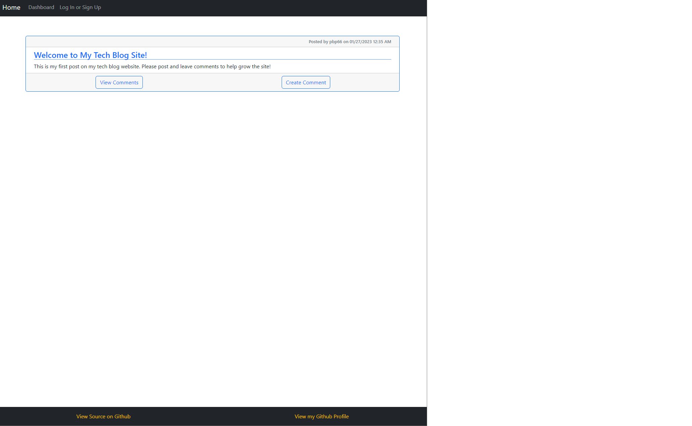
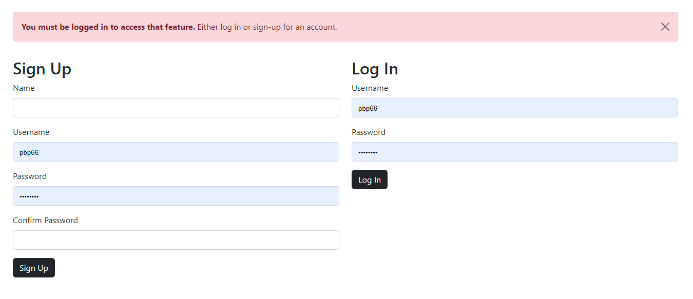
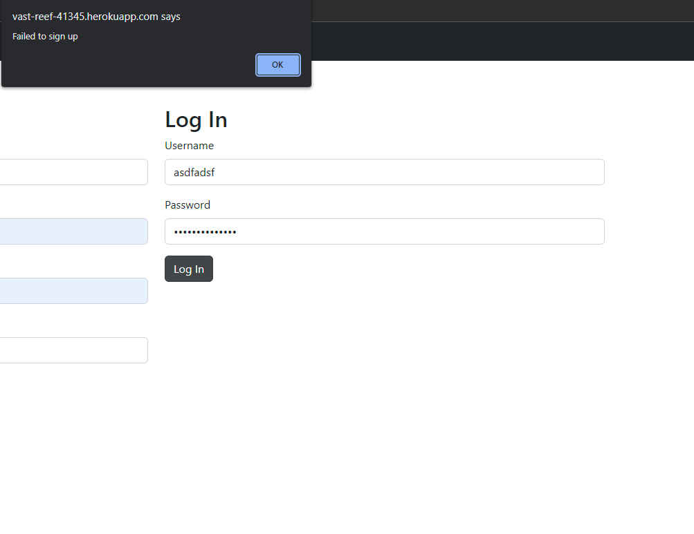
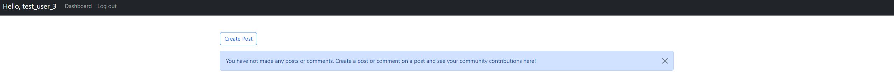
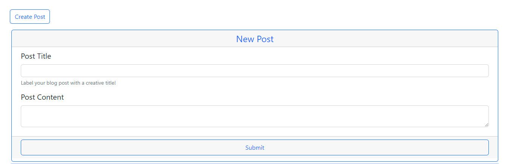
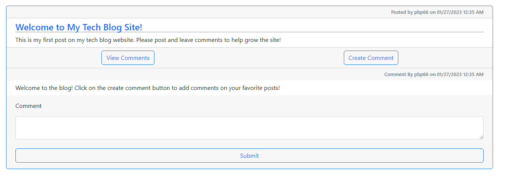
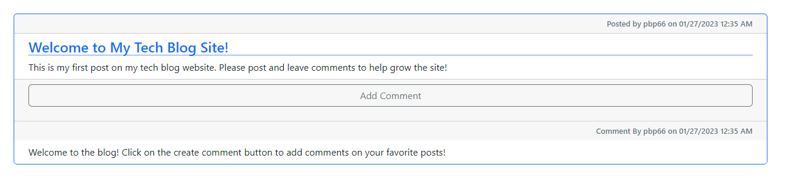
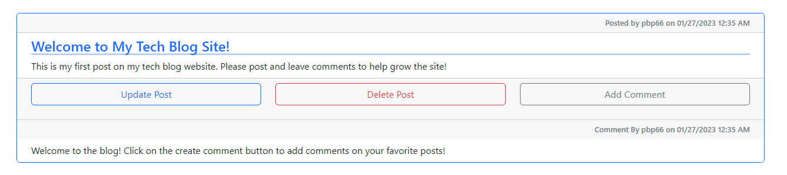
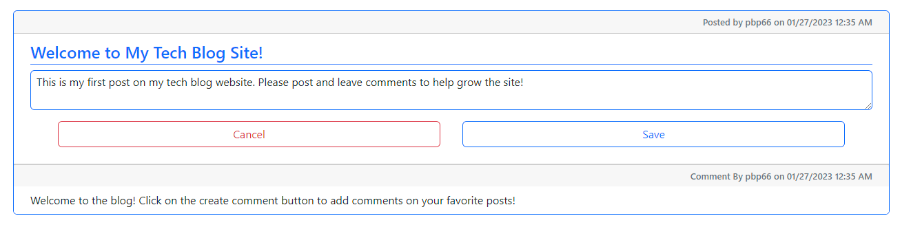
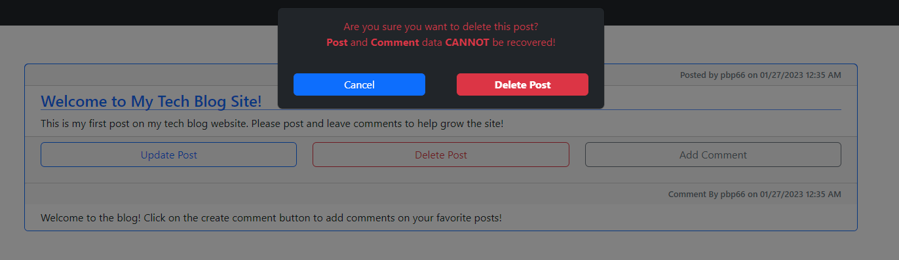

# Simple-tech-blog

## Description

A simple tech blog is a [express.js](https://expressjs.com/) server using [sequelize](https://sequelize.org/) to interface with a MySQL database. The end user has the ability to create an account, create posts, add comments, update posts, and delete posts.

User Story:

```
AS A developer who writes about tech
I WANT a CMS-style blog site
SO THAT I can publish articles, blog posts, and my thoughts and opinions
```

Acceptance Criteria:

```
GIVEN a CMS-style blog site
WHEN I visit the site for the first time
THEN I am presented with the homepage, which includes existing blog posts if any have been posted; navigation links for the homepage and the dashboard; and the option to log in
WHEN I click on the homepage option
THEN I am taken to the homepage
WHEN I click on any other links in the navigation
THEN I am prompted to either sign up or sign in
WHEN I choose to sign up
THEN I am prompted to create a username and password
WHEN I click on the sign-up button
THEN my user credentials are saved and I am logged into the site
WHEN I revisit the site at a later time and choose to sign in
THEN I am prompted to enter my username and password
WHEN I am signed in to the site
THEN I see navigation links for the homepage, the dashboard, and the option to log out
WHEN I click on the homepage option in the navigation
THEN I am taken to the homepage and presented with existing blog posts that include the post title and the date created
WHEN I click on an existing blog post
THEN I am presented with the post title, contents, post creator’s username, and date created for that post and have the option to leave a comment
WHEN I enter a comment and click on the submit button while signed in
THEN the comment is saved and the post is updated to display the comment, the comment creator’s username, and the date created
WHEN I click on the dashboard option in the navigation
THEN I am taken to the dashboard and presented with any blog posts I have already created and the option to add a new blog post
WHEN I click on the button to add a new blog post
THEN I am prompted to enter both a title and contents for my blog post
WHEN I click on the button to create a new blog post
THEN the title and contents of my post are saved and I am taken back to an updated dashboard with my new blog post
WHEN I click on one of my existing posts in the dashboard
THEN I am able to delete or update my post and taken back to an updated dashboard
WHEN I click on the logout option in the navigation
THEN I am signed out of the site
WHEN I am idle on the site for more than a set time
THEN I am able to view comments but I am prompted to log in again before I can add, update, or delete comments
```

## Table of Contents

- [Simple-tech-blog](#simple-tech-blog)
  - [Description](#description)
  - [Table of Contents](#table-of-contents)
  - [Installation](#installation)
  - [Usage](#usage)
  - [License](#license)
  - [How to Contribute](#how-to-contribute)
  - [Tests](#tests)
  - [Questions](#questions)

## Installation

The blog is live at this URL: [Tech Blog](https://vast-reef-41345.herokuapp.com/). To build and host your own, clone the repository and deploy it onto heroku or another server provider.

## Usage

When visiting the blog, the home page will load with all available blog posts sorting by most recent first.



If you try to navigate to the dashboard page, you will be redirect to the login/signup page with an alert banner displayed.



On the login page, you will have option to either log in or sign up. For signing up, if you submit a username that already exists in the system, you will be unable to sign up and the site will display an alert. A successful sign-in or login will redirect you back to the homepage.



Clicking on the dashboard link while logged in will take you to the dashboard page. If you have content to display, the dashboard will load all of your posts and comments. Otherwise, it'll display a banner suggesting you to create a post.



To create a post, click on the create post button to display a form containing a post title and post content. Once filled out, click submit to save the post. The page will reload and display the new post.



To create a comment, click on the create comment button on a post in the dashboard or home views. Clicking submit will save the comment and automatically append the comment to the end of the comment chain.



If you click a post, it'll load on its own page, displaying all comments without a "view comments" button. Clicking "add comment" will add a comment to that post.



clicking on a post you created allows you to update or delete the post.



Clicking on the update button allows you to edit both the title and content if desired. Clicking cancel removes all current changes. Clicking save will save the updated content on the database and reload the page with the updated post.



Clicking on the delete button will prompt the user to confirm they wish to delete the post. Clicking Delete Post will delete the post. It cannot be recovered. Clicking cancel will cancel the delete operation without any ill affects. Clicking either button will dismiss the alert. Deleting a post will remove all associated comments as well.



## License


MIT

Copyright (c) 2023

Permission is hereby granted, free of charge, to any person obtaining a copy of this software and associated documentation files (the "Software"), to deal in the Software without restriction, including without limitation the rights to use, copy, modify, merge, publish, distribute, sublicense, and/or sell copies of the Software, and to permit persons to whom the Software is furnished to do so, subject to the following conditions:

The above copyright notice and this permission notice shall be included in all copies or substantial portions of the Software.

THE SOFTWARE IS PROVIDED "AS IS", WITHOUT WARRANTY OF ANY KIND, EXPRESS OR IMPLIED, INCLUDING BUT NOT LIMITED TO THE WARRANTIES OF MERCHANTABILITY, FITNESS FOR A PARTICULAR PURPOSE AND NONINFRINGEMENT. IN NO EVENT SHALL THE AUTHORS OR COPYRIGHT HOLDERS BE LIABLE FOR ANY CLAIM, DAMAGES OR OTHER LIABILITY, WHETHER IN AN ACTION OF CONTRACT, TORT OR OTHERWISE, ARISING FROM, OUT OF OR IN CONNECTION WITH THE SOFTWARE OR THE USE OR OTHER DEALINGS IN THE SOFTWARE.

## How to Contribute

Before contributing, be sure to read the GitHub [Code of Conduct](https://github.com/github/docs/blob/main/CODE_OF_CONDUCT.md). If you have an issue, search all open issues to see if one matches the description of your issue. If not, proceed to create one providing details on the issue, errors, OS, options provided, installed node packages, etc. Issues are not assigned to anyone by the repository team. To select an issue to work on, open a pull request and generate a new branch labeled as the issue. Add your name as a contributor to the issue in question. When you make the desired changes and fixes, push all changes to your branch on the repository and submit. The repository team will review the changes. If acceptable, we will merge the changes to main and we will notify you of a successful merge or any necessary changes before a merge can take place.

## Tests

No Tests Provided

## Questions

Repo owner: [pbp66](https://github.com/pbp66).
For any questions, you may contact pbp66 via email: pbp66.coding@gmail.com. Please format your email using the following template:

-   Subject: Repository - Question/Issue
-   Body: Summarize the issue with a brief description for the first paragraph. Additional paragraphs can be used for a long description, if needed. Include any errors when using this project
-   Signature: Please leave an email address so that any updates are sent get back to you.
